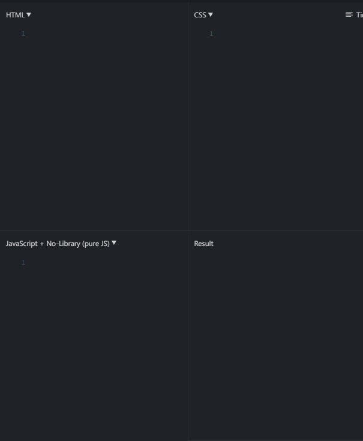
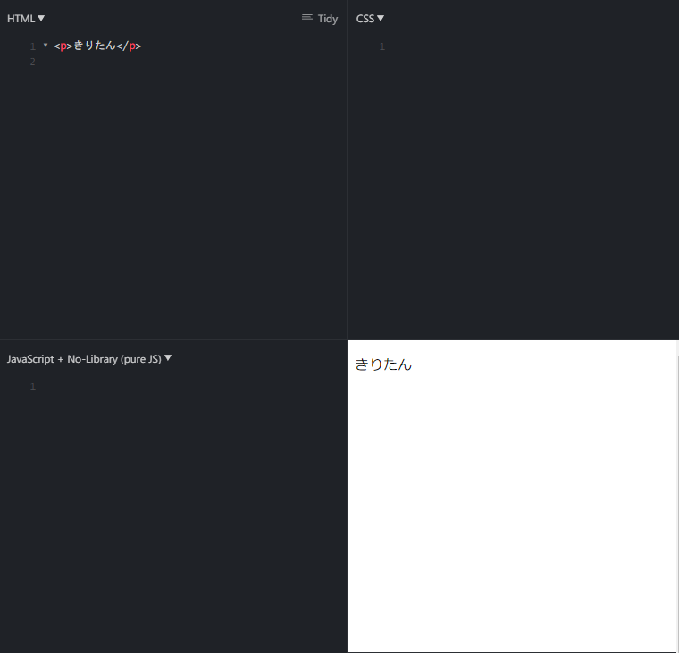
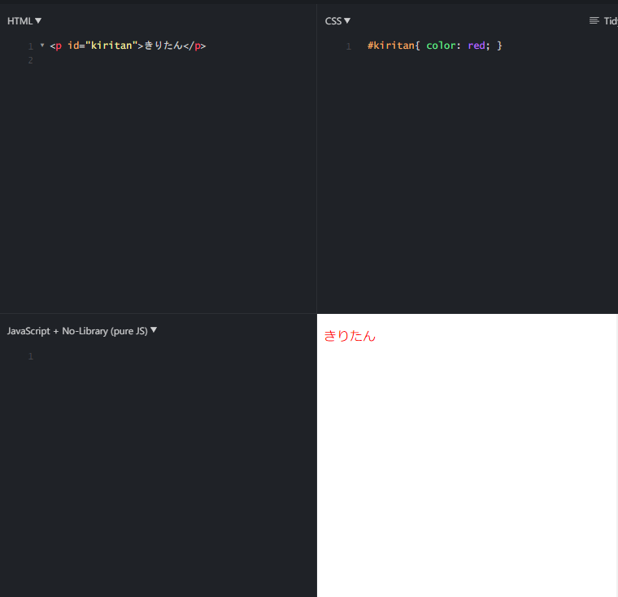
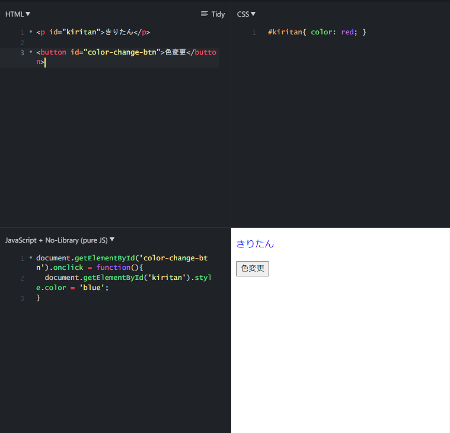
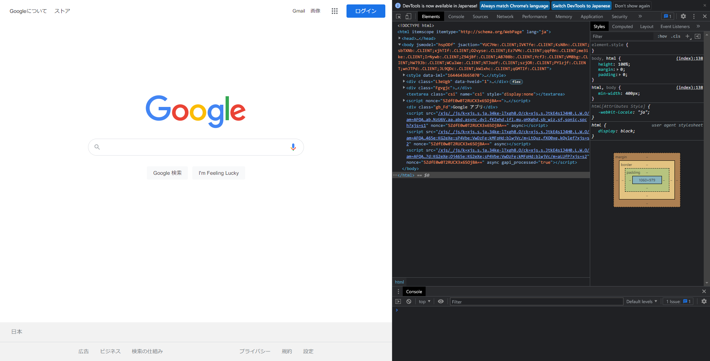
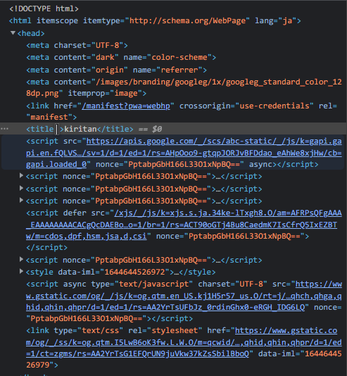

# Chapter0 HTML&CSS
---

きりたんぽ！

とゆーことで、初めていきましょう。

と、いってもまずはJavaScriptではなく、HTMLとCSSの基礎からやります。

なんだよそいつら、と思うかも知れませんし、新しいことを覚えさせるのかとブチ切れるかたもいるかも知れません。

が、これらはプログラミング言語、とは言わずにマークアップ言語、とか言われたりします。

つまり、JavaScriptが動かすことのできるもの、動かせる対象である、ということです。

長々と説明するよりも、実際にやってみましょう。


とりあえず、「jsfiddle」とググって一番上のサイトに行ってください。

これは、ブラウザ上でjavascript, HTML, CSSをかける便利なサイトです。



見ての通り、


- 左上：HTML
- 右上: CSS
- 左下: javaScript
- 右下: 結果

となっております。

というわけで、まずはHTMLからかいてみましょう。

このように、pタグで囲って、きりたん、と打ってみましょう。後ろはスラッシュがいるから気をつけてくださいね。

```
<p>きりたん</p>
```
そして、上部にあるRunをおしてください。



おー、きりたんと表示されています。
素晴らしい！

次に、ここにclass="kiritan"
と打って、
このCSSの部分に、
.kiritan｛color: red｝
と書いて見てください。

```
<p id="kiritan">きりたん</p>
```

```
#kiritan{ color: red; }
```

今の時点では何をやっているかわからなくても大丈夫ですからね！



文字が赤くなりましたね。

次に、下にボタンを作ってみましょう。

buttonで囲って、色変更と書きますと、ボタンができます。

後々のために、idをつけておきます。

```
<p id="kiritan">きりたん</p>

<button id="color-change-btn">色変更</button>
```

ボタンができました。

このままで、押すと…あれ、色は変わりませんね。

それもそのはずで、これはボタンだけを作って何も処理をしていないのです。


ここで、登場するのがJavaScriptです。
とりあえず見様見真似で、このコードをコピペしてください。

```
document.getElementById('color-change-btn').onclick = function(){
	document.getElementById('kiritan').style.color = 'blue';
}
```

何度も何度も言いますが、今の時点では何も分からなくても不安にならなくていいですからね！

そしてボタンを押してみてください！



最高でーす！
色が変わりましたね！

さ、狐につままれたような気持ちかもしれませんが、ここまでの流れで伝えたいことがあります。

まず、私達はHTMLできりたんと表示させました。

これがHTMLのお仕事。文書のベースを作る役割があります。

次に、私達はそれを赤くしましたよね。

これがCSS。

ベースをもとに彩りを与えるお仕事です。


そして、JavaScript！

これが、HTMLとCSSを操作する、動的に変化させることのできるプログラミング言語です。

要素を消したり、変えたり。

色々なことができます。

つまり、JavaScriptを勉強するにあたって、

JavaScriptが操作対象であるHTMLとCSSもある程度は学ぶ必要があるということなんです。

まぁ今回はリッチなウェブサイトを作るのが目的ではないので、最低限のことだけ勉強していきましょう。

---

## サイトを見てみる
それではHTMLからやっていきましょうね。

その前に、世の中のwebサイトが本当にHTMLでできているのか？って思いませんか？

疑心暗鬼になる前に、やってみましょうね.

ちなみに、これ以降のブラウザ操作はクロームを前提としておりますので、恐れ入りますがインストールをお願いします。（インストールの仕方も書いたほうがいい？）


さて、グーグルのページに行きます。

<a href="https://www.google.com/">Googleのページ</a>

ここでページ内で右クリックー＞検証

と押して見てください。

Windowsだと、
コントロール、シフト、I

で、開きます。

するとこんな怖ーい画面が広がりますが、怖がる事はありません。



プログラマが黒い画面に向かっているのは何かすごいことをやっているからではなく、目が疲れるからです。

なので黒い画面に怯える必要はありませんよ！

ここのElementsの部分にHTMLの内容が書かれています。

おー！実際に、HTMLが書かれていますね。
中身をじっくり見て見ましょう。

グイーッと、広げて。

さて、何が書かれているかと言うと、
まず、
```
<!DOCTYPE html>
```

と先頭に書かれています。

これは特に考えなくていいです。

HTML書くぞ！という意気込みみたいなもので、とりあえず脳死でかきましょう。

次に、全体を
```
<html></html>
```
で囲んでいますよね。

これはここからここまでHTMLやで、という意味です。
きりたんの例では書きませんでしたが、基本的にはこれも必ず書きましょう。

HTMLではこのようになにかの要素の中に何かが含まれているといった具合に階層にして、構造をつくっていきます。
```
<タグの名前1>
  <タグの名前2></タグの名前2>
  <タグの名前3></タグの名前3>
  <タグの名前4></タグの名前4>
</タグの名前1>
```
注意点は２つ。
- 後ろにはスラッシュを付けます。
- 内側にある要素はTABキーでスペースをつけて見やすくしましょう
ということです。

特に後者は注意で、
```
<タグの名前1>
<タグの名前2></タグの名前2>
<タグの名前3></タグの名前3>
<タグの名前4></タグの名前4>
</タグの名前1>
```
これでも全く問題なく動きはするのですがものすごく階層構造が見づらいですよね。

なので内側のものには必ずTABを先頭に付けて見やすくしましょう。

### Head

その中にheadタグで囲まれていますね。

これは、あまり皆さんの目には映らない、いろいろなサイトの情報が入っているところです。

サイトのタイトルとか、どんな言語（英語か日本語かみたいな）でかかれているかとかそういうことが書かれています。

外部からファイル読み込むのもここです。

しいていうなら、サイトのタイトルはブラウザのタブで表示されていますね。

ということで、いたずらしてみましょう。



ここの
```
<title></titie>
```
の中を好きな言葉にかえてみてください

なんてことするんだと思われるかもしれませんが、これはもうすでに受けとって手元にあるページにいたずらしているだけなので、

世界中のページがそうなってしまうわけではないので安心してください。

タイトルがかわりましたか？

このように、Headの中にはいろいろな情報があります。

次にbody

これが、皆さんの目に映るところです。

色々開いてマウスを当ててみると、どこがどこに対応しているのかがわかると思います。

実際に、htmlでできていることがわかりましたね！


それじゃあ、実際に書いていこうではありませんか。

このセクションでは、基本的な要素のお勉強をしていただきます。

講座の初めにも言いましたが、決して全て覚えろ、というわけではありません。
こんなものがあるんだな、と把握しておけば十分です。

----
### html基礎

先程の説明からして、webページに最低限必要なものかを考えるとこんなふうになると思います。

```
<!DOCTYPE html>
<html lang="ja">
    <head>
        <meta charset="UTF-8">
        <title>なにかしらのタイトル</title>
    </head>
    <body>
        <p>きりたん</p>
    </body>
</html>
```

ちょっと、
```
<meta charset="UTF-8">
```

が追加されとるやないか、と思われたかもしれません。

これは、どのような文字コードを使うかを宣言するものです。

文字コードとは、パソコン用が読み取る用の暗号みたいなものと私達が使う文字を対応させたものです。

この対応表はいくつか種類があり、それを誤ると文字化けします。

大概は書かなくてもうまく読み取れるのですが、たまに文字化けにつながるので念の為宣言しておきましょう。

これに加えて、headにいろいろな情報を追加することができます。

１つ目がサイトキャプションです。

皆様が、グーグルとかで検索したときに、結果が一覧表示された際、説明文のようなものが出てくると思います。それをここに設定するとができます。

また、検索エンジンもこの部分をみて、サイトを関連度順に並び替えたりもするので、たくさんの方にアクセスしてほしかったらここの説明文を充実させるのも結構重要です。
```
<meta name="description" content="ボイロたちを応援するためのサイトです。練習用で製作中">
```
次はキーワード、これは主にグーグルなどの検索エンジンにこんなサイトだよと伝える役割があります。

が、最近はグーグルも賢くなり、このキーワードではなく中身をちゃんと見て関連度を調べるようになりました。

なので、この部分は任意で大丈夫です。
```
<meta name="keywords" content="ボイロ, きりたん, ずん子">
```
headはいったんこのあたりでしょうか？
これらを書き足すとこのようなコードになります。

今までのものを全部消して、JSFIDDLEに書いてみましょう。

```
<!DOCTYPE html>
<html lang="ja">
    <head>
        <meta charset="UTF-8">
        <meta name="description" content="ボイロたちを応援するためのサイトです。練習用で製作中">
        <meta name="keywords" content="ボイロ, きりたん, ずん子">
        <title>なにかしらのタイトル</title>
    </head>
    <body>
        <p>きりたん</p>
    </body>
</html>

```

はじめとと見た目変わらんやないか、と思われた方。

正しいです。

そう、JSfiddleはかんたんなプレビューしかしてくれないので、Webのタイトルとかを表示はしてくれません。

というわけで次回は、ブラウザ上ではなく、皆さんのPCで勉強ができて、サイトのプレビューもできるように準備していきましょう。