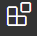

# HTML基礎

----

## VScodeを入れる

開発できる環境を作るとなると、少し難しそうと思う方がいらっしゃるかもしれませんが、実際のところVScodeをインストールするだけです。

VScodeとは、要はコードを書くことに特化しためっちゃ高機能なメモ帳です。

めちゃ高機能なメモ帳なので恐れることはありません。安心してインストールしましょう。

といっても、VScodeと検索してひたすら進むボタンを押せばよいだけです。

<a href="https://azure.microsoft.com/ja-jp/products/visual-studio-code/">VScodeのダウンロードページ</a>

注意点としては、インストールを進めていくうちに、
追加タスクの選択という欄が現れると思います。

ここで、チェックをすべてに入れておくと後々便利です。

インストール完了したら、開いてみましょう。

ゴリッゴリの英語の画面が出てくると思います。

なので、日本語化していきましょう。



左にあるこのボタンを押して、「Japanese」と検索。

一番上に出てきた地球儀のマークを選択して、青いインストールのボタンを押してください

完了したら再起動。

すると、日本語表示に変わったと思います。

かなり、使いやすくなりましたね。

ちなみに、先程のように、VScodeでは世界の誰かが作ってくれた拡張機能を導入することができます。

文法ごとにをハイライトしたり、コードを自動補正してくれるものもあります。

お気に入りのものがあればつかっていきましょう。

---
## Projectの作成

ということで、projectを作っていきます。

好きなところに、好きな名前のProjectを作成してください！

今回は、「kiritan-project」にしました。

ここからProjectを作っていくわけですが、その前に設定が必要です。

それが、拡張子の表示設定です。

拡張子とは

kiritan.txt

の.txtの部分でそのファイルがなんのファイルなのかを示す役割があります。

が、勝手に変更するとファイルが壊れる可能性があるので、普段お使いになられているものでは、それが表示されていないことがほとんどです。

ですが、本講座では拡張子の変更は必須なので、表示できるように設定していきましょう。

エクスプローラーの左上、表示の部分をくりっくしてください。


すると、以下のような部分が現れます。


ここのファイル名拡張子にチェックをいれてください！（隠しファイルのところは今は大丈夫です）

これで拡張子が見えるようになりました。

----
## htmlファイルをつくる
というわけで、HTMLファイルを作りましょう。

色々と作り方はありますが、とりあえず、作成したプロジェクトファイル内で、右クリック、新規作成、テキストドキュメントで、index.txtを作りましょう。

名前は今回はindex.txtにしましょう。

慣習的に一番最初に入るページはindexとされているいるからです。

このままでは、テキストドキュメントなので、これをhtmlファイルに変えましょう。

変えると言っても、名前を変更から.txtを.htmlに変更するだけです。

すると、アイコンがクロームの見た目になったと思います。

試しにクリックするとクロームが立ち上がって真っ白い画面が表示されることでしょう。

さて、このファイルに前回の講座で書いたところまでをコピペしてやりましょう。

index.htmlを右クリック、Codeで開く、で編集できるようになるので、

```
<!DOCTYPE html>
<html lang="ja">
    <head>
        <meta charset="UTF-8">
        <meta name="description" content="ボイロたちを応援するためのサイトです。練習用で製作中">
        <meta name="keywords" content="ボイロ, きりたん, ずん子">
        <title>なにかしらのタイトル</title>
    </head>
    <body>
        <p>きりたん</p>
    </body>
</html>

```
を貼り付けて、

ControlとSを押して保存。

そしてブラウザをリロードしてみてくださいね。

すると、このようにタイトルがタブに表示され、


中身がこのように表示されていることでしょう。


これで、最低限開発環境は整いましたね。

では、htmlの学習を再開しましょう。


---
### 補足
VSCodeにはたくさんのショートカットがあります。
そのうち必須なのは
- Ctrl + S: 保存
- Ctrl + Z: 一つ前の操作に戻る
- Ctrl + Y: 戻した操作をやり直す

です。これらは便利なので覚えましょう。

----

## 各種タグについて

書いたところまでを再掲します。

```
<!DOCTYPE html>
<html lang="ja">
    <head>
        <meta charset="UTF-8">
        <meta name="description" content="ボイロたちを応援するためのサイトです。練習用で製作中">
        <meta name="keywords" content="ボイロ, きりたん, ずん子">
        <title>なにかしらのタイトル</title>
    </head>
    <body>
        <p>きりたん</p>
    </body>
</html>

```

今の時点で、bodyタグの中には、

```
<p></p>
```

があります。

これは、pタグといって段落を示す役割があります。

paragraphの略ですね。

これの最大の特徴は、必ず改行されるということです。


```
<!DOCTYPE html>
<html lang="ja">
    <head>
        <meta charset="UTF-8">
        <meta name="description" content="ボイロたちを応援するためのサイトです。練習用で製作中">
        <meta name="keywords" content="ボイロ, きりたん, ずん子">
        <title>なにかしらのタイトル</title>
    </head>
    <body>
        <p>きりたん</p>
        <p>ずんこ</p>
    </body>
</html>

```

保存してリロードしてみてくださいね。

すると、ずんこお姉さまが並んでいると思います。
いや、下に書いたから当たり前だろと思うかもしれませんが、
```
<!DOCTYPE html>
<html lang="ja">
    <head>
        <meta charset="UTF-8">
        <meta name="description" content="ボイロたちを応援するためのサイトです。練習用で製作中">
        <meta name="keywords" content="ボイロ, きりたん, ずん子">
        <title>なにかしらのタイトル</title>
    </head>
    <body>
        <p>きりたん</p><p>ずんこ</p>
    </body>
</html>

```

このように書いても下に表示されます。

つまり、HTMLはTABやスペースと同じく、改行も意味はありません。

あるタグを使えば並べて書こうが改行するし、そうでなければこちらが改行しても意味がありません。並べて表示されます。

これが意外とハマりやすいポイントなので注意です。

では、改行されないものもあるのでしょうか？

あります。一つの例が、spanタグです。

このように書いてみてください。

```
<!DOCTYPE html>
<html lang="ja">
    <head>
        <meta charset="UTF-8">
        <meta name="description" content="ボイロたちを応援するためのサイトです。練習用で製作中">
        <meta name="keywords" content="ボイロ, きりたん, ずん子">
        <title>なにかしらのタイトル</title>
    </head>
    <body>
        <span>きりたん</span><span>ずんこ</span>
    </body>
</html>

```
pタグをspanに変えただけです。

おおー、きりたんとずん子がくっついていますね（意味深）

仮にこう書いても同じ表示になります。

```
<!DOCTYPE html>
<html lang="ja">
    <head>
        <meta charset="UTF-8">
        <meta name="description" content="ボイロたちを応援するためのサイトです。練習用で製作中">
        <meta name="keywords" content="ボイロ, きりたん, ずん子">
        <title>なにかしらのタイトル</title>
    </head>
    <body>
        <span>きりたん</span>
        <span>ずんこ</span>
    </body>
</html>
```

タグにはこのように性質がある、ということをご理解いただけましたでしょうか？

これ以降は、いろいろなタグを説明していきます。

講座の冒頭でもお話したとおり、これらは、決して覚える必要はありません。

こんなものがあったな、と思い出せる程度に、見ていただければ大丈夫です。

あと、これ以降は記述量をへらすために、

bodyの中身だけを表示します。

それ以外の部分は、そのままでお願いします。

---

### divタグ

では次にお勉強するタグはdivタグです。

これの特徴は以下です。

- 改行される
- 単独で意味を成す、というよりはページを分割して構成するために使う

分けるという意味のDivideから来ている（多分）とおり、2つ目の意味が重要です。

これからページを作っていくうちに、ここからここまではなになにで、ここからは、みたいな構想が浮かぶと思います。

それを明示してやり、後々学習するCSSの彩りの範囲を指定する意味でも重要となってくるもものです。

と、いっても単独ならpとあまり変わらず、改行されるだけです。

一応やってみましょう。

```
<body>
    <div>きりたん</div>
    <div>ずんこ</div>
</body>
```

pと比べて少し上下のスペースが小さいくらいでしょうか。

まあ、divの用途は後々わかってくるので次に行きましょう。

---

### h1, h2...h6タグ

見出し、を意味するタグです。

このタグだけは特殊で、大きさの順番で、h1, h2... h6まで書くことができます。

実際にやってみてみましょう。

```
<body>
    <h1>きりたん</h1>
    <h2>ずんこ</h2>
    <h3>いたこ</h3>
    <h4>あかね</h4>
    <h5>あかり</h5>
    <h6>ゆかり</h6>
</body>
```


なんともシュールな絵面ですが、このように大きさ順で表すことができます。

基本的には、　h1はページに一つ、h2は見出しごとに、以降は適宜というのが一般的な使いかたのような気はします。

---

# ul & li とoi & liタグ

これらはリスト表示に使います。

ちょっと特殊な使い方が必要です。

これも使ってみたほうが早いでしょう。

```
<body>
  <ul>
    <li>きりたん</li>
    <li>ずんこ</li>
    <li>いたこ</li>
  </ul>
  <ol>
    <li>あかね</li>
    <li>あかり</li>
    <li>ゆかり</li>
  </ol>
</body>
```
これをコピペして、リロードしてみてくださいね。

すると、


このように上3つは、ただの箇条書き、
下3つは番号が振られていますね。

つまり、ulに囲まれたliは丸


つまり、olに囲まれたliはナンバリングされる

ということです。


---

# bottonタグ

ボタンです。
```
<body>
  <button>押しても意味のないボタン</button>
</body>
```

このように書くと、おしても意味のないボタンができます。

将来的にはこれがクリックされたときにこの処理を行う、みたいなことを学ぶのでとりあえず、形だけ学びましょう。

ちなみにこのようにタグ内にdisabledをつけると
```
<body>
  <button disabled>押せないボタン</button>
</body>
```

押せないボタンになります。


----

### inputタグ

webアプリとかを使っていたらよく見かける、何かを入力したりする機能を持つタグです。
```
<body>
  <input>
</body>
```

注意点としては、閉じタグ
```
</input>
```

がいらないということです。

そしてこのinput、色々と機能を付加できます。
```
<body>
  <input placeholder="入力してね">
</body>
```


このように書くとからのときに文字が表示されます。
```
<body>
  <input placeholder="入力してね" type="password">
</body>
```


このようにパスワードっぽく表示されなくなったりします。

他にも無限に機能はあるのですがきりが無いので必要なときに適宜説明する方式で行きます！


----

### select optionタグ

選択するタグです。

これは前述した、ul liの関係と似ています。
```
<body>
  <select>
    <option>きりたん</option>
    <option>ずんこ</option>
    <option>いたこ</option>
  </select>
</body>
```

このようにselectを親にして、optionタグを付けることで、

optionの数だけ選択肢がある選択項目を作ることができる機能です。


----

### a タグ


リンクを作成するためのタグです
```
<body>
  <a href="https://www.ah-soft.com/">ボイスロイドのダウンロードはこちら</a>
</body>
```

このように書くと、

タグの内側に書かれた文字で表示した上で、

```
href=""
```

の中身のURLにクリックすると遷移するリンクが作れます。

---
### imgタグ

ホームページに画像を入れたいことが往々にしてあると思います。

それを叶えるのがこのimgタグ

ですが、表示する画像もないので、まず、本プロジェクト、今回ですとkirita-projectの中にimgというフォルダを作ります。

そして以下URLから好きなきりたんの画像をダウンロードしてこのフォルダにいれてくださいね。

そして以下のコードを作ります。

```
<body>
  
</body>
```
閉じタグのないimgの中には、srcとaltの2つの要素がありますね。

src=には、画像の場所を書きます。
```
./
```
とはこのファイルの場所という意味です。
```
./img/
```
imgフォルダの中の、
```
./img/kiri_3006_cr.png
```
だよ！という意味ですね。

もしかしたら画像によって、ファイルの名前が違うと思うのでそこは適宜変えてください

altに入っている文字は、何かの表紙で画像が表示されなかったりするときに変わりに表示する文字です。

あと、目の見えない方が音声再生で閲覧するときにも読み上げられる対象なので、入力したほうが親切なサイトになります。

では、表示してみましょう。


でかい。完全にガチ恋距離です。

このままでもいいというか、いっそこのままがいいのですが、お勉強のためにサイズを変更しましょう。
```
<body>
  
</body>
```

width: 横サイズ

height: 縦サイズ

です。

元の画像の縦横比を考慮するとこんな感じになりましたが、適宜変えてください。


全体像が見えるようになりましたね。

画像があるとないとでは彩りが全く違いますね。

---

## 知っとくとよいタグ

ここからは、見た目には一切関係しないが、知っておくと良いタグについて教えます。

これらの機能は、基本的に一番最初に説明した、divタグと同じ効果を持ちます。

ならdivでいいじゃん！と思うかもしれませんが、前回学習したdiscriptionを思い出してください。

検索エンジンというものは最近非常に賢く、自動的にこのサイトが見やすいのか否かを判定してくれます。

つまり、私達は検索エンジン（グーグル先生やヤフー先生）にこのサイトはこんな構造をしていますよ！というものを教えることができるんです。

そしてその構造は検索順位に大きく影響します。

なので、このあたりを丁寧にやるかいなかで作ったものが見てもらえるかが変わってきてしまうのです。

そんなに覚えることもないです。まとめて書きましょう。

```
<body>
  <header>ヘッダー</header>
  <section>セクション</section>
  <header>フッター</header>
</body>
```

### ヘッダーとフッター

ページの上部と下部に、サイトの情報であったりメニューがあったり、プライバシーポリシーなんかがあったりする光景、見たことあると思います。

それを明示するのがheaderとfooterです。

### section
これはdivとは違って、私達が便宜上分けたものではなく、

意味として分けたもの、になります。

どういうことかというと、例えばレイアウトの関係でdivを使って見た目を整えることはあると思います。

これは、そのdivの中に情報がまとまっているわけではなく、便宜上そうするものです。

これに対して、sectionというタグはここはこれについて説明している、ここはあれについて説明しているというふうに意図を持って分けることができます。

そしてそれが検索エンジンに伝わります。

なので、意味をみった塊をつくるものと覚えてください。

---

### コメント機能

htmlに限った話ではありませんが、あらゆる言語にはコメント機能があります。

コメント機能とは、コンピューターに読み込まれることはない記述のことです。
開発者があとから見返したときに、どこに何が書いてあるのかを思い出すためにあります。

コードというものは難解で、自分で書いたものでさえ数日後みたら意味不明に思えることがあります。

チームで開発するならなおさらです。

なので、コメントを書く癖をつけましょう。

```
<body>
  <header>ヘッダー</header>
  <section>セクション</section>
  <header>フッター</header>
</body>
```

先程のこのコードに、

```
<body>
  <!-- きりたん -->
  <header>ヘッダー</header>
  <section>セクション</section>
  <header>フッター</header>
</body>
```
というふうに、

```
<!--  -->
```
で囲まれたものを追加して見てください。

ページには追加されていませんね。

このようにメモ書きとして使うことができます。


VSCODEでは、Ctrl + / でその行をコメントにすることもできるので、積極的に使っていきましょう。

---

## まとめ

大量の情報が一気に流れ込んできて疲れたと思います

ですが、まとめると
- vscodeというパワフルなメモ帳がある
- .htmlという拡張子のファイルにwebページを作れる
- いろいろな機能を持ったタグが標準搭載されている
- コメントをかこう！

ということだけです。

というわけで次回以降は、この技術を使ってページを作ってみましょう。