# Chapter3 実践HTML

----

ということで、ホームページを作っていきましょう。

講座のイントロダクションでもお話したとおり、覚えたらすぐ使って見るに限ります。

今回目指す最終形はこちら。

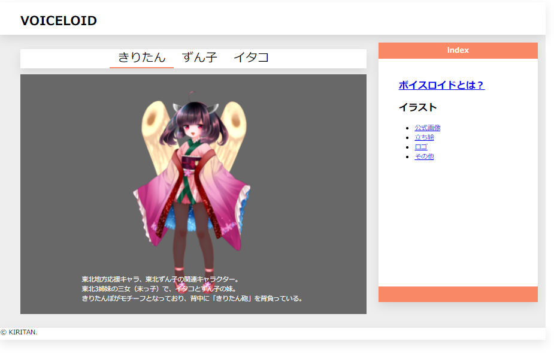

...まあお世辞にもおしゃれとは言えないというか、平成感ただようページですが、htmlを学習するには丁度いいくらいのボリュームかと思われます。

（中の人のデザインセンスが壊滅的だからとは言えない）

まだCSSを学習していないので、ここまで彩りあるページにはできませんが、現時点でできるところまで頑張って作っていきましょう。

CSSを学べばそれに彩りを与え、最終的にはJAVASCRIPTを学習してページを色々と操作
できる、というふうに増築スタイルで進めていきましょう。

そのほうがモチベーションが上がりますからね。

また、実践編では復習のために時々クイズを出していきますね。

といっても覚えていないことを咎めるためのものではなく、単に退屈しないためなので気軽に見てください。

---

## project作成

では、プロジェクトを再度作りましょう。

まあ先程のプロジェクトをまっさらにしたり消しても良いのですが、今回は折角なのでいちから作り直しましょう。

ちなみに私はkiritan-homepageというフォルダを作成しました。

名前はわかるやつでいいです。

そしてこの中にindex.htmlを作成します。

ここでクイズです。

どうやってhtmlファイルを作りますか？

どうして、index.htmlという名前にするんでしたっけ？

1つ目の正解は右クリックでテキストドキュメントを新規作成してから拡張子を変更する、でしたね。

2つ目の正解は、慣習的にindexという名前がサイトの入口になるから、でしたね。

わからなかった方は、前回の動画を100回見返してください（再生数稼ぎ）。

冗談はさておき、index.htmlを作成したら、中身を書いていきます。

といっても、前回のコピペで構いません。

```
<!DOCTYPE html>
<html lang="ja">
    <head>
        <meta charset="UTF-8">
        <meta name="description" content="ボイロたちを応援するためのサイトです。練習用で製作中">
        <meta name="keywords" content="ボイロ, きりたん, ずん子">
        <title>ボイロ紹介ページ</title>
    </head>
      <body>
      </body>
</html>
```

discriptionの部分を「ボイロたちを応援するためのサイトです。練習用で製作中」に変更したくらいでしょうか。

ページを作成する上で、ここまでの記述は雛形のようなものなので仕組みさえ理解してしまえば以降はコピペで大丈夫です。

次は、ページ全体を大きく分けていきましょう。

私はWEBデザイナーやコーダーではないので、美しいデザインのページを作ることは専門ではありませんので、もしかするともっと良い方法があるかもしれませんが、私なりの作り方をお伝えします。

ページ全体がどのような構造をしているのかをイメージして、

大体のアタリをつけ、そこから詳細の描写へと進んでいく方法がやりやすいかと思います。

絵なんかと同じですね。

まずものすごく大きく分けると、このページは、ヘッダー、メインとなるコンテンツ、そしてフッターに分かれていることがわかりますね。

イメージ通りに書いていきましょう。

あ、これ以降もbodyの中身だけを表示しますのでご注意ください。

```
<body>
  <div>
    <header></header>
    <section></section>
    <footer></footer>
  </div>
</body>
```

前回の復習も兼ねていますが、このような形になると思われます。

あれ、bodyの中に直接書かずにdivを挟んでいるのはなぜ？　と思われたかもしれません。

これは明確な理由はないのですが、今後ページを操作していく上でbodyの中にある要素はひとかたまりにしておいたほうが良い、という事情があります。


---

## ヘッダーに画像を追加してみる

さて、それでは細部の描写に取り組んでいきましょう。

まずは、ヘッダーの文字から。

完成品でいうとこの場所ですね。

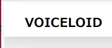

目を引く場所ですから今回は一番大きい見出しにでもしてみますか。

一番大きい見出しは何だったでしょうか。

h1タグですね。

というわけでこう書きます

```
<body>
  <div>
    <header>
      <div>
        <h1>VOICELOID</h1>
      </div>
    </header>
    <section></section>
    <footer></footer>
  </div>
</body>
```

またまたheaderの中をdivで一要素にまとめていること以外は特筆することもありませんね。

ここまで書いてページをブラウザで開くとこのような表示になるかと思われます。


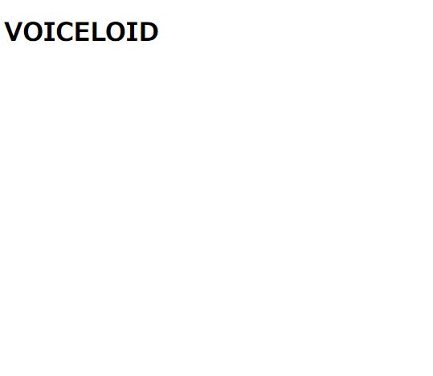

まだまだ殺風景ですが、一応要素が追加されましたね。

---

### メインセクションの構成を考える

続いて、メインセクションの構造を考えていきましょう。

メインセクションとはここの部分のことですね。

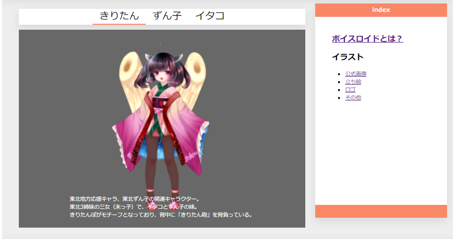

ここを大きく分けるとなると、どのように分けるでしょうか。

難しく考える必要はありません。

この画像を表示している部分と、

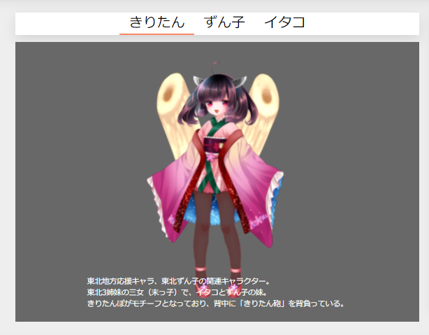

サイドにあるリンクのまとめたところに別れますね。

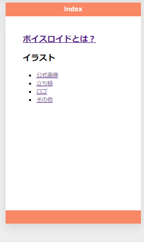

というわけでそれをコードに落とし込んでいきましょうね。

```
<body>
  <div>
    <header>
      <div>
        <h1>VOICELOID</h1>
      </div>
    </header>
    <section>
      <section></section>
      <section></section>
    </section>
    <footer></footer>
  </div>
</body>
```

セクションの中にセクションが2つできただけですね。


### タブの部分の骨組みを考える

メインセクションを作っていきましょう。

つくった2つのセクションの中身に色々書いていくわけです。

まず、タブの部分の骨組みを考えていきましょう。

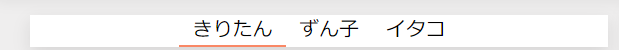


ここですね。

表現の仕方はいろいろですが、今回はリストを使って、三姉妹を羅列してみましょう。

リストを使った場合、縦になるじゃないかと思われると思いますし、実際そうなのですが、レイアウトに関しては後日学ぶCSSでできるようになるので今回は気にせず要素だけを作っていきましょう。

リストを表現するにあたって、どのようなタグを使用するんでしたっけ？

そう、ul と li あるいは olとliでしたね

今回は番号は必要ないのでulとliで表現してみましょう。

```

<body>
  <div>
    <header>
      <div>
        <h1>VOICELOID</h1>
      </div>
    </header>
    <section>
      <section>

        <!-- ここからタブ -->
        <div>
          <ul>
            <li>きりたん</li>
            <li>ずん子</li>
            <li>イタコ</li>
          </ul>
        </div>
        <!-- ここまでタブ -->

      </section>
      <section></section>
    </section>
    <footer></footer>
  </div>
</body>
```

コメントを付けてわかりやすくしてみました。

外側をdivで囲んでいること以外は、ここも復習ですね。

今の時点での見た目はこんなふうになります。

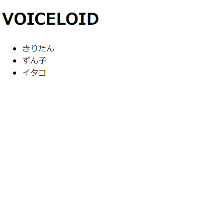

。。。完成が程遠く思えるかもしれませんが、意外とそうでもありませんので頑張っていきましょう。

---

### 画像を表示する


お次は画像ですね。

表示する画像は好きなものを用意して、index.htmlファイルの隣にimgフォルダを作ってその中に入れておく想定でやります。

- index.html
- img
  - 画像1
  - 画像2

みたいなファイル構造です。

さて、imgを表示するタグは？と言いたいところですがそろそろ嫌われそうなので素直に進めます。

imgタグを使って、画像は表示します。

例のごとくガチ恋距離にならないようにサイズも調整しましょう。

```
<body>
  <div>
    <header>
      <div>
        <h1>VOICELOID</h1>
      </div>
    </header>
    <section>
      <section>

        <!-- ここからタブ -->
        <div>
          <ul>
            <li>きりたん</li>
            <li>ずん子</li>
            <li>イタコ</li>
          </ul>
        </div>
        <!-- ここまでタブ -->

        <!-- ここから画像 -->
        <div>
          
        </div>
        <!-- ここまで画像 -->
        
      </section>
      <section></section>
    </section>
    <footer></footer>
  </div>
</body>
```

- src: 画像の場所
- alt: 画像が表示されなかった時の文字
- width: 横
- height: 縦

でしたね。他の画像を使われている方はサイズは適宜変えてみてくださいね。

閉じタグが必要ないのもimgタグの特徴でしたね！

現時点でこのような見た目になりました。

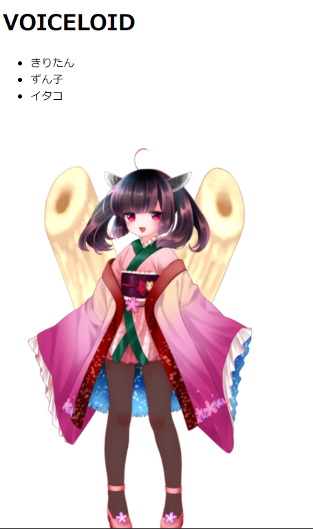

画像があるとやっぱり違いますね（2回目）。

そして、この画像の中に白い文字で説明があるんでしたね。

まだ、画像の中に文字を重ねる方法は学んでいないので、とりあえず下へ下へと表示していきましょう。

といっても、画像のブロックの下に文字を入れるだけです。

コードが長くなってきたので、ここから画像、ここまで画像のところを拡大しますね

他のところ消しちゃだめですよ。

```
<!-- ここから画像 -->
<div>
  
  <p>東北地方応援キャラ、東北ずん子の関連キャラクター。<br>
    東北3姉妹の三女（末っ子）で、イタコとずん子の妹。<br>
    きりたんぽがモチーフとなっており、背中に「きりたん砲」を背負っている。</p>
</div>
<!-- ここまで画像 -->
```

pタグで文字を表現しました。

ところどころあるbrってなんやねん。

これはタグ内で改行を明示するいみを持ちます。

htmlはいくら改行しても表示には関係ないんでしたね。

じゃあ改行するために、段落がひとつなのいちいちタグで囲んでいかないといけないのかというわけではなく、このように改行をすることができます。

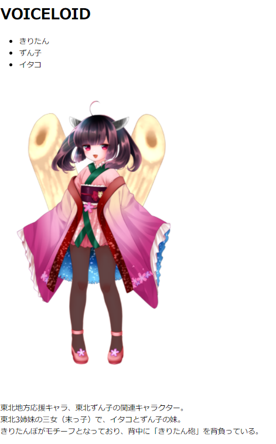

下へ下へと伸びていっていますが細かいことは気にしてはいけません。

ひとまずこれで、メインの部分は終わりました。

現時点でこのようなコードになっているかを確認してくください

```
<!DOCTYPE html>
<html lang="ja">
    <head>
        <meta charset="UTF-8">
        <meta name="description" content="ボイロたちを応援するためのサイトです。練習用で製作中">
        <meta name="keywords" content="ボイロ, きりたん, ずん子">
        <title>ボイロ紹介ページ</title>
    </head>
    <body>
      <div>
        <header>
          <div>
            <h1>VOICELOID</h1>
          </div>
        </header>
        <section>
          <section>

            <!-- ここからタブ -->
            <div>
              <ul>
                <li>きりたん</li>
                <li>ずん子</li>
                <li>イタコ</li>
              </ul>
            </div>
            <!-- ここまでタブ -->

            <!-- ここから画像 -->
            <div>
              
              <p>東北地方応援キャラ、東北ずん子の関連キャラクター。<br>
                東北3姉妹の三女（末っ子）で、イタコとずん子の妹。<br>
                きりたんぽがモチーフとなっており、背中に「きりたん砲」を背負っている。</p>
            </div>
            <!-- ここまで画像 -->

          </section>
          <section></section>
        </section>
        <footer></footer>
      </div>
    </body>
</html>
```

---

### サイド

この調子でサイドの部分も作ってしまいましょう。

サイドと言っても例のごとく、html単独では横並びに表示することは難しいので下へ下へと書いていきましょう。

サイドの構造は簡単ですね。

大きい文字があってあとは箇条書きでリンクがあるだけです。

```
<body>
  <div>
    <header>
      <div>
        <h1>VOICELOID</h1>
      </div>
    </header>
    <section>
      <section>

        <!-- ここからタブ -->
        <div>
          <ul>
            <li>きりたん</li>
            <li>ずん子</li>
            <li>イタコ</li>
          </ul>
        </div>
        <!-- ここまでタブ -->

        <!-- ここから画像 -->
        <div>
          
          <p>東北地方応援キャラ、東北ずん子の関連キャラクター。<br>
            東北3姉妹の三女（末っ子）で、イタコとずん子の妹。<br>
            きりたんぽがモチーフとなっており、背中に「きりたん砲」を背負っている。</p>
        </div>
        <!-- ここまで画像 -->

      </section>

      <!-- ここからサイド -->
      <section>
        <div>
          <h2><a href="#">ボイスロイドとは？</a></h2>
          <h2>イラスト</h2>
          <ul>
            <li><a href="#">公式画像</a></li>
            <li><a href="#">立ち絵</a></li>
            <li><a href="#">ロゴ</a></li>
            <li><a href="#">その他</a></li>
          </ul>
        </div> 
      </section>
      <!-- ここまでサイド -->
      
    </section>
    <footer></footer>
  </div>
</body>
```

ここからサイドの部分を付け足しました。

一気に進めちゃいましたが、ここは復習がほとんどです。

```
<!-- ここからサイド -->
<section>
  <div>
    <h2><a href="#">ボイスロイドとは？</a></h2>
    <h2>イラスト</h2>
</section>
<!-- ここまでサイド -->

```

ちょっと大きい見出しにはh2を使うんでしたね。

そして一番上の見出しはリンクになってほしいので中にaタグを入れました。

aタグはなかに表示する文字、hrefにリンク先を書くんでしたね。

開発中とかにどこにも飛ばさないリンクを作りたい場合、#を入れておくとどこにも飛ばさないものが作れるので便利ですよ。

```
<!-- ここからサイド -->
<section>
  <div>
    <h2><a href="#">ボイスロイドとは？</a></h2>
    <h2>イラスト</h2>
    <ul>
      <li><a href="#">公式画像</a></li>
      <li><a href="#">立ち絵</a></li>
      <li><a href="#">ロゴ</a></li>
      <li><a href="#">その他</a></li>
    </ul>
  </div> 
</section>
<!-- ここまでサイド -->
```

そしてその下に、同様にリストを作りその中にaタグを入れただけです。

ね？簡単でしょ？（圧）

---

### フッター

疲れてきましたね。

実は作成している中の人も疲れてきています。

なので駆け足でフッターを作ってしまいましょう。

足だけにな！！！！

```
<body>
  <div>
    <header>
      <div>
        <h1>VOICELOID</h1>
      </div>
    </header>
    <section>
      <section>

        <!-- ここからタブ -->
        <div>
          <ul>
            <li>きりたん</li>
            <li>ずん子</li>
            <li>イタコ</li>
          </ul>
        </div>
        <!-- ここまでタブ -->

        <!-- ここから画像 -->
        <div>
          
          <p>東北地方応援キャラ、東北ずん子の関連キャラクター。<br>
            東北3姉妹の三女（末っ子）で、イタコとずん子の妹。<br>
            きりたんぽがモチーフとなっており、背中に「きりたん砲」を背負っている。</p>
        </div>
        <!-- ここまで画像 -->

      </section>

      <!-- ここからサイド -->
      <section>
        <div class="side-header-content">
          <h2><a href="#">ボイスロイドとは？</a></h2>
          <h2>イラスト</h2>
          <ul>
            <li><a href="#">公式画像</a></li>
            <li><a href="#">立ち絵</a></li>
            <li><a href="#">ロゴ</a></li>
            <li><a href="#">その他</a></li>
          </ul>
        </div> 
      </section>
      <!-- ここまでサイド -->

    </section>
    <footer>
        &copy; KIRITAN.
    </footer>
  </div>
</body>
```

footerのなかに文字を入れただけです。
```
&copy; 

```

ってなんやねん。これは著作権マークです。

こう書けば著作権マークになってくれるというだけです。

htmlにはこのように特殊文字を生成してくれる魔法のコトバがあります。

必要なときにググれば良いので、覚える必要はありません。

このようなものもあるんだなと思っていてください。

---
### お疲れさまです

全体を再掲します

```
<!DOCTYPE html>
<html lang="ja">
    <head>
        <meta charset="UTF-8">
        <meta name="description" content="ボイロたちを応援するためのサイトです。練習用で製作中">
        <meta name="keywords" content="ボイロ, きりたん, ずん子">
        <title>ボイロ紹介ページ</title>
    </head>
    <body>
      <div>
        <header>
          <div>
            <h1>VOICELOID</h1>
          </div>
        </header>
        <section>
          <section>

            <!-- ここからタブ -->
            <div>
              <ul>
                <li>きりたん</li>
                <li>ずん子</li>
                <li>イタコ</li>
              </ul>
            </div>
            <!-- ここまでタブ -->

            <!-- ここから画像 -->
            <div>
              
              <p>東北地方応援キャラ、東北ずん子の関連キャラクター。<br>
                東北3姉妹の三女（末っ子）で、イタコとずん子の妹。<br>
                きりたんぽがモチーフとなっており、背中に「きりたん砲」を背負っている。</p>
            </div>
            <!-- ここまで画像 -->

          </section>

          <!-- ここからサイド -->
          <section>
            <div>
              <h2><a href="#">ボイスロイドとは？</a></h2>
              <h2>イラスト</h2>
              <ul>
                <li><a href="#">公式画像</a></li>
                <li><a href="#">立ち絵</a></li>
                <li><a href="#">ロゴ</a></li>
                <li><a href="#">その他</a></li>
              </ul>
            </div> 
          </section>
          <!-- ここまでサイド -->

        </section>
        <footer>
            &copy; KIRITAN.
        </footer>
      </div>
    </body>
</html>
```

あとから見返すとクソ長く見えるかもしれません。

でも、この講座を見る前だと呪文に思えるこの文字列が今は理解できるのではないでしょうか。

こんなふうに、少しずつ紐解いていけば必ずコードは読めるしかけるようになります。

なのでこれからも頑張っていきましょう。

現時点ではこのような見た目になっているはずです。


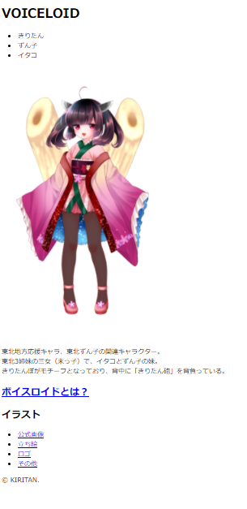

通信中にトンネルに差し掛かって圏外になったときみたいな見た目していますが、強い心を持ちましょう。

あと少しで見本のものが作れるようになります。

さて、次はCSSですね。

おつかれさまでした。